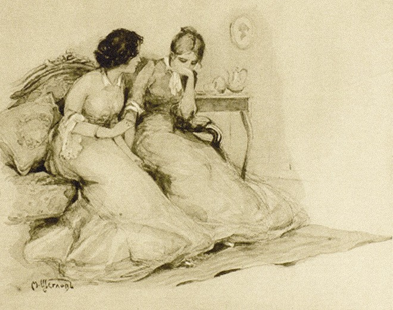

## Динамика лексических характеристик 
**Актуальность**. В гуманитарных науках все большее значение приобретают цифровые методы, которые позволяют выявить скрытые закономерности в текстах на основе их количественного анализа. В последние годы произведения Л. Н. Толстого плодотворно изучаются в рамках Digital Humanities. В частности, в свете векторных моделей рассматривалась индивидуальная семантика автора, а с помощью лексико-статистических методов его творчество сопоставлялось с творчеством современных ему писателей. 

Нередко объектом исследований становился **роман «Война и мир»**. Сегодня можно найти работы, посвященные анализу речи героев романа с применением методов стилометрии , выявлению иерархии персонажей и характера их взаимоотношений с помощью сетевого анализа , изучению пространства и перемещения героев с применением цифрового картографирования. Однако для **романа «Анна Каренина»** подобных исследований найдено не было, с точки зрения количественной динамики лексики это произведение не рассматривалось. 

**Цель работы** – выявить и описать динамику лексических характеристик в романе Л. Н. Толстого «Анна Каренина» с помощью цифровых инструментов и статистических методов. В качестве материала для проведения исследования взят текст романа, разделенный на восемь частей в соответствии с оригинальной структурой произведения. 

**Гипотеза** заключается в том, что лексические характеристики частей романа не являются однородными, то есть между ними существуют статистически значимые различия, которые можно связать с сюжетной линией произведения. 

**Для достижения цели и проверки гипотезы поставлены следующие задачи:**

- Выполнить предварительную обработку текста. 

- Получить описательную статистику для каждой части произведения. 

- Отобрать значимые для сюжета слова и проанализировать их распределение по тексту романа.

- Сгруппировать части по лексическому сходству. 

- Интерпретировать результаты и сделать вывод о наличии или отсутствии лексической динамики в романе. 

> Если добро имеет причину, оно уже не добро; если оно имеет последствие – награду, оно тоже не добро. Стало быть, добро вне цепи причин и следствий.

{width=80% fig-align="center"}

## Карта храмов Москвы Тверского района

<iframe src="temples_moscow_tmp.html" width="100%" height="500" frameborder="0"></iframe>